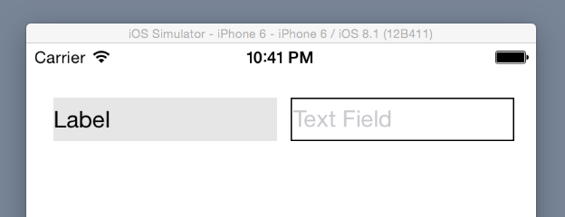

# yavfl

[](https://travis-ci.org/safx/yavfl)
[](http://codecov.io/github/safx/yavfl?branch=master)


yavfl is Yet Anoter Visual Format Language for Auto Layout.

## Usage

In yavfl, you can write the code of visual format language as follows:

```swift
visualFormat(label, textField) { l, t in
    .v ~ |-40-[l,==32];
    .v ~ |-40-[t,==32];
    .h ~ |-20-[l,==t]-10-[t]-|
}
```

* Trailing `;`s are needed since Xcode 7 beta 3 when you will write multiple statements in a block.



The following code is the equivallent code of the original visual format:

```swift
let dic = ["l": label, "t": textField]
label.setTranslatesAutoresizingMaskIntoConstraints(false)
textField.setTranslatesAutoresizingMaskIntoConstraints(false)
let c1 = NSLayoutConstraint.constraintsWithVisualFormat("V:|-40-[l(32)]", options: nil, metrics: nil, views: dic)
let c2 = NSLayoutConstraint.constraintsWithVisualFormat("V:|-40-[t(32)]", options: nil, metrics: nil, views: dic)
let c3 = NSLayoutConstraint.constraintsWithVisualFormat("|-20-[l(==t)]-10-[t]-|", options: nil, metrics: nil, views: dic)
self.view.addConstraints(c1)
self.view.addConstraints(c2)
self.view.addConstraints(c3)
```

If you aren't familiar with Visual Format Language, please visit [the original Visual Format Language page](https://developer.apple.com/library/ios/documentation/UserExperience/Conceptual/AutolayoutPG/VisualFormatLanguage/VisualFormatLanguage.html) first.

## More Examples

| yavfl                                         | origial                                   |
|-----------------------------------------------|-------------------------------------------|
| `.h ~ [button]-[textField]`                   | `[button]-[textField]`                    |
| `.h ~ [button,>=50]`                          | `[button(>=50)]`                          |
| `.h ~ |-50-[purpleBox]-50-|`                  | `|-50-[purpleBox]-50-|`                   |
| `.v ~ [topField]-10-[bottomField]`            | `V:[topField]-10-[bottomField]`           |
| `.h ~ [maroonView]-0-[blueView]`              | `[maroonView][blueView]`                  |
| `.h ~ [button,==100~20]`                      | `[button(100@20)]`                        |
| `.h ~ [button1,==button2]`                    | `[button1(==button2)]`                    |
| `.h ~ [flexibleButton,>=70,<=100]`            | `[flexibleButton(>=70,<=100)]`            |
| `.h ~ |-[find]-[findNext]-[findField,>=20]-|` | `|-[find]-[findNext]-[findField(>=20)]-|` |


## Limitations

* Yavfl does not check syntatic validity. You don't expect the code is valid even if its compilation succeeded.
* *Connection*'s *predicateList* supports only one *predicate*.
* function `visualFormat` supports up to 5 views.

## Differences from the Original Visual Format Language

Some parts of the syntax are changed due to Swift's syntax limitation.

* Do not use `()` for view's *predicate*.
    * Use `[button1,==button2]` instead of `[button1(==button2)]`.
* Use `~` instead of `:` for *orientation* and `@` for *priority*, because these can not be used for custom operators.
    * Use `.h ~ |-[view]-|` instead of `h:|-[view]-|`.
    * Use `[view,==100~200]` instead of `[view(==100@200)]`.
* *Orientation* (`.h` or `.v`) and operator `~` are required for applying layout constraints.
    * Operator `~` is a trigger for creating and applying constraints.
* *Connection* (`-`) is required between views.
    * `[v1][v2]` is not allowed due to the syntax limitation. Use `[v1]-0-[v2]` instead.
* *Relation* (`==`, `<=` or `>=`) is required for *predicate*.
    * `[view,100]` is not allowed. Use `[view,==100]` instead.


## Install

    pod 'yavfl'

Or, just copy `yavfl.swift` into your project.

## Other Resources (in Japanese)

* [Blog article](http://safx-dev.blogspot.jp/2014/12/auto-layoutvisual-format-languageswift.html)
* [Slide @ Speaker Deck](https://speakerdeck.com/matuyuji/visual-format-languageka-jian-dan-nishu-keruswiftraihurari-yavfl)
